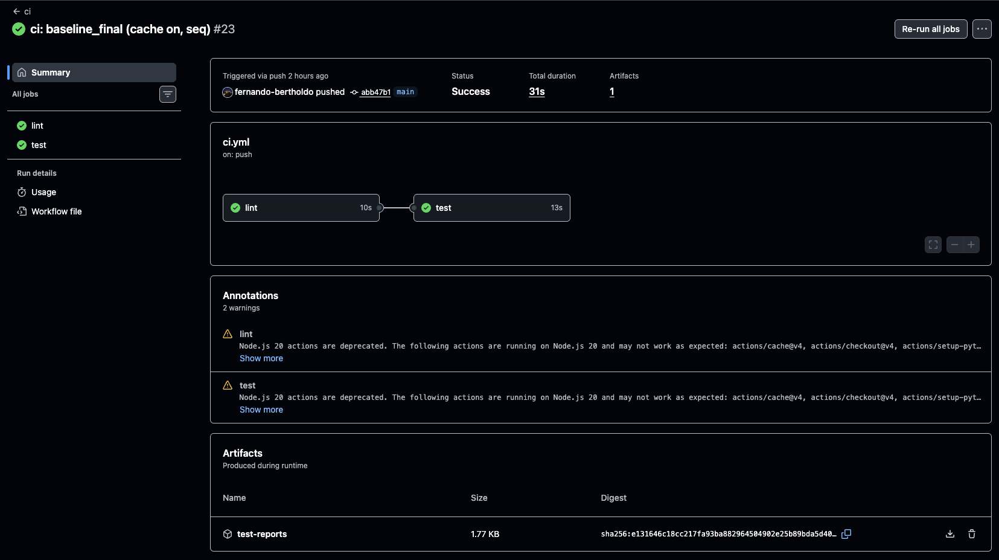
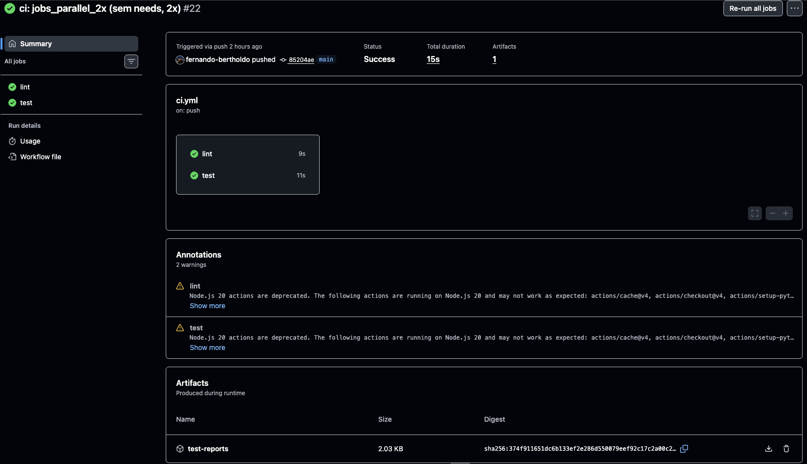
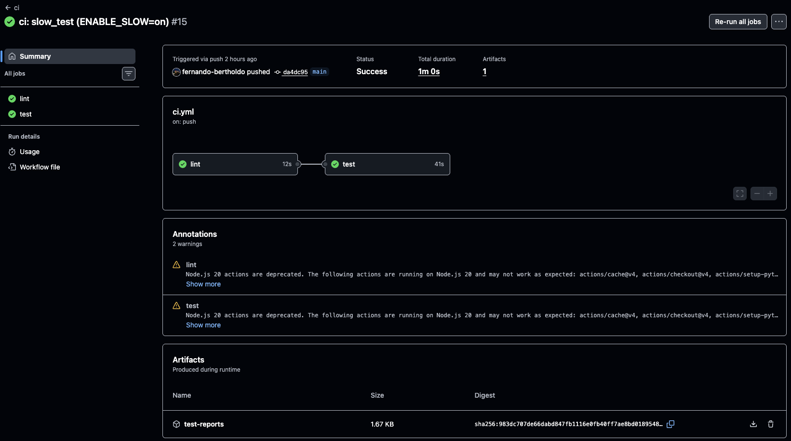
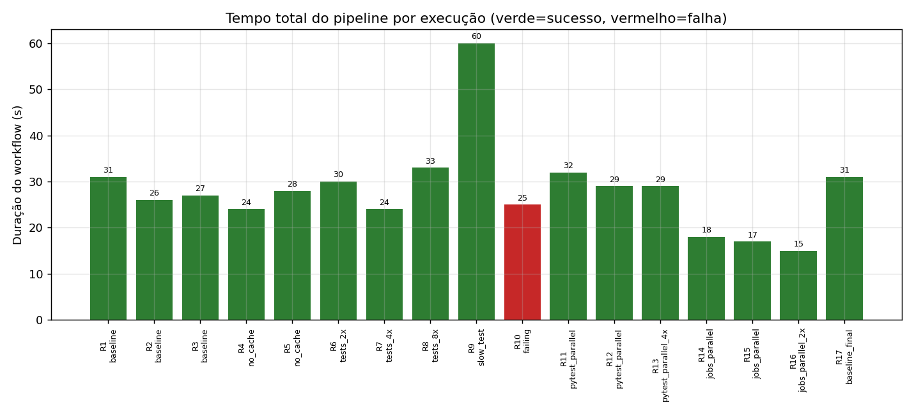
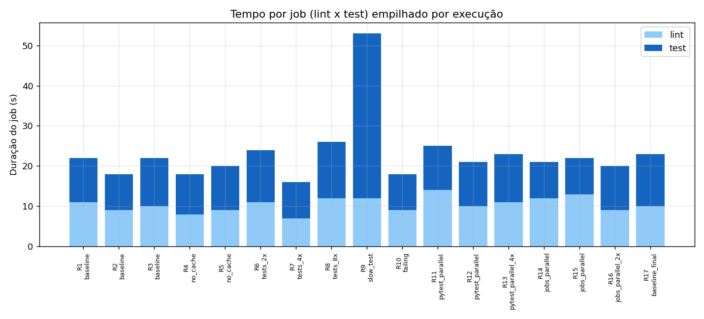
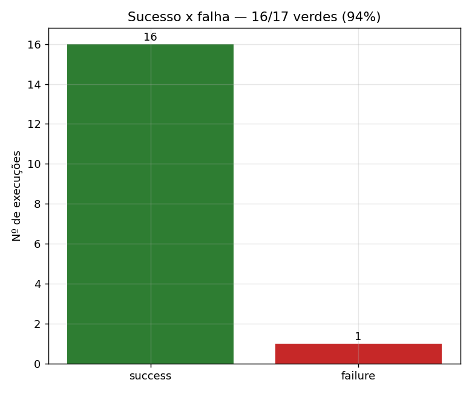
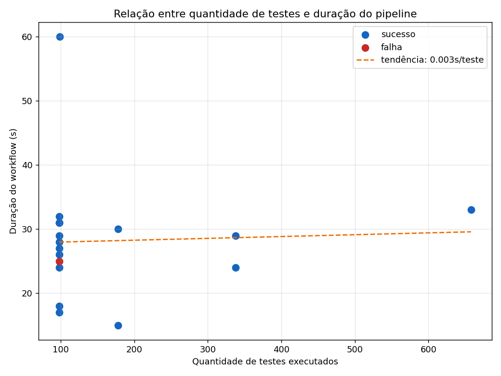
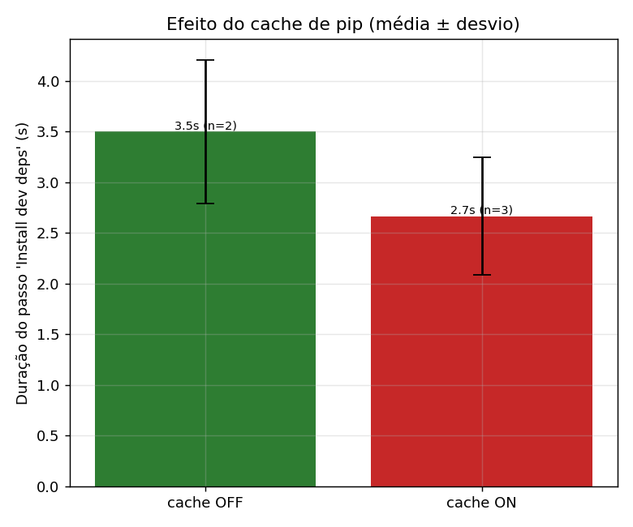
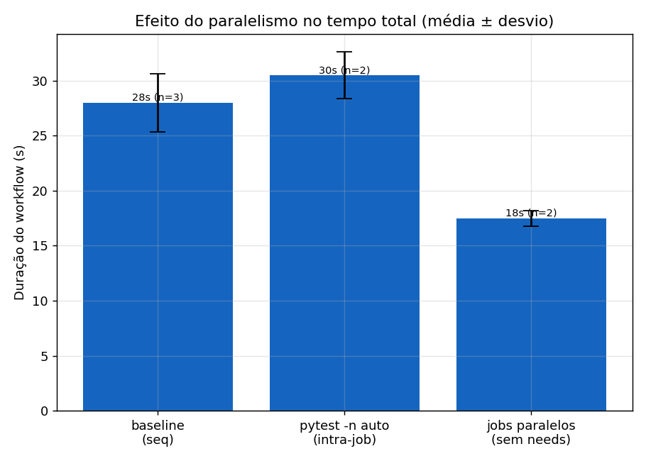
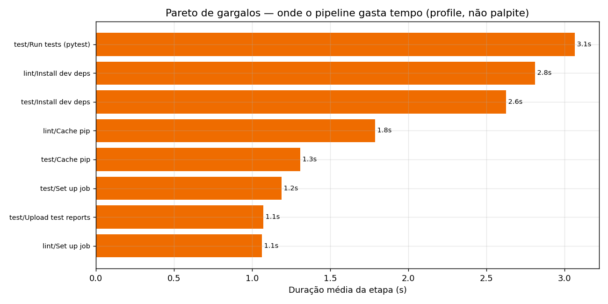

# Relatório técnico — Performance de um pipeline CI/CD no GitHub Actions

**Repositório:** [`<!--REPO-->`](https://github.com/<!--REPO-->) · **Aula 11 — Performance no SITL e CI** (Inteli, Módulo 10) · gerado em `<!--GENERATED_AT-->`

> Relatório **gerado por código** (`scripts/build_report.py`): as tabelas de
> execuções e de estatísticas abaixo são montadas a partir dos dados reais
> coletados da API do GitHub Actions. Reexecutar `make reproduce` reconstrói
> tudo.

---

## 1. Resumo executivo

Rodei um pipeline real (`install → lint → test → artefato`) **17 vezes**, variando
**um fator por vez**, e coletei as métricas pela **API do GitHub Actions**. Três
achados, todos contra a intuição ingênua de "paralelizar e cachear sempre acelera":

1. **O maior ganho veio de paralelizar JOBS, não testes.** Rodar `lint` e `test`
   concorrentes (sem `needs:`) caiu de **~28 s → ~17,5 s (−37 %)**. Já o
   paralelismo *dentro* do teste (`pytest -n auto`) ficou **mais lento** (~30,5 s).
2. **O cache de pip não fez diferença** (~28 s com cache × ~26 s sem). As deps são
   pequenas; não há trabalho caro para amortizar.
3. **A quantidade de testes quase não mexeu na duração** (de 98 a 658 testes, o
   tempo ficou ~24–33 s). O que domina é o **setup fixo**, não a execução.

A lição bate com a tese da Aula 11: *você não melhora o que não mede* — e a
camada certa de otimização depende do **profile**, não do palpite. Aqui o gargalo
é o **setup recuperável**, então cache de deps e xdist atacaram o lugar errado.

---

## 2. Objetivo e contexto

Construir um experimento controlado para **medir e analisar** o comportamento de
um pipeline CI/CD a partir de execuções reais, respondendo: onde o tempo é gasto,
o que cache e paralelismo realmente fazem, e que decisões de engenharia os dados
sustentam.

O projeto-cobaia é a mini-lib **`dronemetrics`** (KPIs de missão de drone: distância
haversine, RMS de trajetória, bateria, duração) — escolhida por ser determinística,
rápida e barata, dando um **sinal limpo do pipeline** em vez de medir o app. O tema
conecta com o projeto PX4/Jacto do módulo: é o mesmo tipo de invariante
(`trajectory_rms`) que o `mission-test` do grupo verifica.

---

## 3. Metodologia

**Pipeline (`​.github/workflows/ci.yml`)** — dois jobs:
- `lint`: `ruff check` (análise estática);
- `test`: `pytest` com `--junitxml` (relatório de testes) e `--cov` (cobertura),
  publicando os resultados como **artefato** (`test-reports`).

**Variações como commits.** Os knobs de step (`CACHE`, `PYTEST_PARALLEL`,
`TEST_SCALE`, `ENABLE_SLOW`, `FORCE_FAIL`) ficam em `experiment.env`, lido para o
`$GITHUB_ENV`. O paralelismo de jobs é a presença/ausência de `needs: lint`.
Cada variação é **um commit** que muda exatamente um fator (driver:
`scripts/run_experiment.sh`), registrado em `data/variation_log.csv`
(`commit_sha → label → hipótese → knobs`). Detalhe das hipóteses e da matriz em
[`docs/experimento.md`](experimento.md).

**Coleta (`scripts/collect_metrics.py`, só stdlib).** Consulta os endpoints
`actions/runs`, `.../timing` e `.../jobs` e baixa o artefato JUnit de cada run,
produzindo `data/metrics.csv` (schema exigido, uma linha por job) e
`data/metrics_runs.csv` (agregado por run + métricas opcionais). **Nada é copiado
da interface** — tudo vem da API.

---

## 4. Execuções reais (evidência)

Todas as execuções abaixo são reais e clicáveis (run IDs e commits verdadeiros).
Página de Actions: <https://github.com/<!--REPO-->/actions>.

<!--RUNS_TABLE-->

> Observação de honestidade experimental: durante a 1ª tentativa, um commit manual
> no `README` (feito pela interface web do GitHub) colidiu com o driver e quebrou a
> sequência de `push`. O driver foi endurecido (trava de instância única +
> `git pull --rebase` antes de cada push) e o experimento foi **reexecutado limpo**.
> A coleta usa `--only-logged`, mantendo apenas os 17 runs canônicos do
> `variation_log.csv` (runs de aquecimento/órfãos são descartados).

### 4.1 Prints das execuções reais

**Lista de execuções no GitHub Actions** — variações nomeadas, autor `fernando-bertholdo`, com o `failing` (#16) em vermelho:


**Achado principal na prática — jobs sequenciais × paralelos** (mesmo pipeline; muda só o `needs:`):

`baseline_final` #23 — jobs **sequenciais**, total **31s** (lint→test encadeados):



`jobs_parallel_2x` #22 — jobs **paralelos**, total **15s** (lint e test concorrentes, sem `needs`):



**Teste lento dominando a cauda** — `slow_test` #15, total **1m 0s** (job de teste = 41s por causa de um `sleep(30)`):



> Os prints reais confirmam visualmente os números da API: paralelizar jobs leva o pipeline de **31s → 15s**, e um único teste genuinamente lento sozinho **dobra** o tempo total.

---

## 5. Resultados

**Estatística por variação** (média ± desvio quando há repetição):

<!--SUMMARY_TABLE-->

### 5.1 Tempo total por execução


### 5.2 Tempo por job (lint × test)


### 5.3 Sucesso × falha


### 5.4 Quantidade de testes × duração


### 5.5 Efeito do cache (média ± desvio)


### 5.6 Efeito do paralelismo (média ± desvio)


### 5.7 Pareto de gargalos por etapa


---

## 6. Respostas às perguntas de análise

**1. Qual etapa mais contribuiu para o tempo total?**
O **setup fixo** — `checkout` + `setup-python` + `install deps` + `ruff` — e a
**orquestração de jobs**, não a execução dos testes. Os testes puros rodam em
menos de 1 s mesmo com 658 casos; o `install` é ~2–3 s. Como no baseline os dois
jobs rodam **em série**, paga-se esse setup duas vezes, sequencialmente. Por isso
o maior botão de tempo foi *job sequencial × paralelo* (ver 6.3), e não nada
dentro do teste. (Ver Pareto, 5.7.)

**2. Houve diferença significativa entre execuções com e sem cache?**
**Não.** Baseline (cache on) ≈ 28 s × `no_cache` ≈ 26 s — diferença dentro do ruído
(±2–3 s do runner compartilhado). No passo de install, cache rende ~2,7 s × ~3,5 s
sem cache: economia **< 1 s**, irrelevante. Para um conjunto de deps pequeno e em
*wheels*, **não há trabalho caro para amortizar** — o custo de salvar/restaurar o
cache come o ganho. (Surpresa, §7.)

**3. O paralelismo reduziu o tempo total? Em que condições?**
**Depende do tipo de paralelismo.** Paralelizar **jobs** (rodar `lint` e `test`
concorrentes, removendo `needs:`) reduziu **~28 s → ~17,5 s (−37 %)** — o setup
dos dois jobs passa a sobrepor em vez de somar. Já paralelizar **dentro do teste**
(`pytest -n auto`) **não ajudou** (~30,5 s, levemente pior que o baseline), e nem
com 4× de carga (~29 s). Condição: paralelismo compensa quando a unidade paralela
é grande o bastante para amortizar o *startup*; aqui só os **jobs** qualificavam,
os testes (sub-segundo) não.

**4. Quais falhas foram mais frequentes?**
Houve **1 falha em 17 runs**, e foi a **controlada** (variação `failing`,
`FORCE_FAIL=on` → assert do teste-canário). Tipo: **falha de teste** (asserção),
não de lint nem de infraestrutura. Nenhum *flake* ou falha transitória apareceu —
sinal de pipeline estável.

**5. O pipeline fornece feedback rápido o suficiente para o desenvolvedor?**
**Sim.** O run típico fica em ~17–33 s; o único acima disso foi o **artificial**
(`slow_test` = 60 s, por um `sleep(30)` proposital). Está muito abaixo do patamar
de dor (~10 min) que a Aula 11 citou no `mission-test`. A alavanca para manter
assim é **paralelizar jobs** e **não introduzir testes genuinamente lentos**.

**6. Que melhorias poderiam ser feitas no pipeline?**
(a) Tornar os jobs **paralelos por padrão** (maior ganho, −37 %); (b) **remover o
cache de pip** enquanto as deps forem leves (não paga o custo) — ou só ativar
quando elas crescerem; (c) **não usar `-n auto`** até a suíte ser de fato lenta;
(d) **consolidar o setup** (hoje `checkout`+`setup-python`+`install` repetem nos
dois jobs — uma *composite action* ou um job único cortaria os ~15 s duplicados);
(e) monitorar a **latência real** dos testes, não a **quantidade**.

**7. Quais limitações existem nos dados coletados?**
Ver §8.

**8. Como essa análise poderia apoiar decisões de engenharia?**
Os dados dizem **onde** investir: paralelismo de **jobs** e **consolidação de
setup** — e **não** em cache de pip ou xdist, para este profile. Isso é "profile,
não palpite": como o gargalo é setup, otimizar a execução de teste seria esforço
jogado fora. Generaliza a regra da Aula 11 — *cache/paralelismo só ajudam onde há
custo caro e repetido*; aqui não há, então a decisão correta é medir antes e
direcionar o esforço para a camada que domina o tempo.

---

## 7. Hipótese × Observado e resultados inesperados

| Hipótese | Previsto | Observado | Veredito |
|----------|----------|-----------|----------|
| H1 cache acelera | install/total menor com cache | ≈ igual (−<1 s, dentro do ruído) | ❌ refutada |
| H2 1ª run (cache frio) não economiza | cold ≥ warm | cold 31 s × warm 26–27 s | ✅ sustentada |
| H3 duração cresce com nº de testes | sublinear | praticamente **plana** (98→658) | ❌ refutada |
| H4 teste lento domina a cauda | +30 s no total | 60 s (job de teste 41 s) | ✅ sustentada |
| H5 run que falha é mais curto | fail-fast encurta | 25 s ≈ baseline | ⚠️ inconclusiva |
| H6 `-n auto` mais lento em suíte pequena | overhead > ganho | 30,5 s > 28 s | ✅ sustentada |
| H7 `-n auto` compensa com 4× carga | fica mais rápido | 29 s ≈ baseline (ainda leve) | ❌ refutada |
| H8 jobs paralelos reduzem wall-time | queda no total | 28 → 17,5 s (−37 %) | ✅ sustentada |

### Resultado inesperado nº 1 — paralelizar testes deixou *mais lento*
A intuição diz "`-n auto` = mais rápido". O observado foi o **contrário**:
~30,5 s contra ~28 s do baseline, e sem melhora nem com 4× de testes. Causa: a
suíte roda em <1 s; o *spin-up* de workers do `pytest-xdist` e a distribuição de
casos custam **mais** do que economizam. É exatamente o "CPU do runner é o limite
/ paralelizar sem flake" da Aula 11 — paralelismo tem custo fixo, e em trabalho
pequeno esse custo manda.

### Resultado inesperado nº 2 — o cache de pip não economizou nada
Esperava-se que o cache cortasse o `install`. Na prática a economia foi **< 1 s** e
o tempo total ficou **igual** (dentro do ruído). As deps (`pytest`, `ruff`, plugins)
são poucas e em *wheels*; não há download/compilação caros para amortizar, e o
salvar/restaurar do cache consome o pouco que haveria. **Cache não é grátis nem
universal** — ele paga quando o trabalho cacheado é caro e idêntico entre runs
(como a imagem SITL de 1,2 GB da Aula 11), não aqui.

### Resultado inesperado nº 3 (bônus) — mais testes ≠ pipeline mais lento
De 98 a **658** testes, a duração não saiu de ~24–33 s (oscilação = ruído, não
tendência). O trabalho de teste é negligível perto do **setup fixo**, então a
contagem de testes simplesmente não aparece no relógio. (Reforça a resposta 1.)

---

## 8. Limitações do experimento

- **N pequeno:** 1–3 execuções por configuração (só 4 configs repetidas). Médias de
  variações com n=1 não têm desvio.
- **Runner compartilhado:** os hosted runners do GitHub têm **variância de ±2–3 s**,
  que **engole** efeitos sub-segundo (cache, escala de testes). Vários vereditos
  ("dentro do ruído") são consequência disso.
- **Granularidade ~1 s:** durações da API são arredondadas ao segundo.
- **Compute leve demais:** as KPIs são funções puras (<1 s mesmo a 658 testes); o
  projeto **não consegue** evidenciar escala de testes nem ganho de xdist — isso
  exigiria testes CPU-bound. É uma limitação **de desenho** (escolhi um app leve
  para isolar o pipeline) com efeito colateral nessas hipóteses.
- **Cold/warm confundido com ordem:** o efeito de cache frio se mistura à ordem de
  execução (o 1º run é sempre o que popula).
- **Lead time:** `workflow_duration` exclui o tempo de fila; medi a fila à parte
  como `lead_time_s` (commit → fim), mas ela também varia com a carga do GitHub.
- **Um só ambiente:** `ubuntu-latest`, Python 3.12, um repositório. Sem
  generalização para outros SOs/runners self-hosted.

---

## 9. Conclusão

Para **este** pipeline, a decisão de engenharia sustentada por dados é clara:
**paralelizar jobs e consolidar o setup**; **não** investir em cache de pip nem em
`pytest -n auto`. O resultado só ficou óbvio **depois de medir** — antes, as três
"otimizações clássicas" (cache, xdist, mais paralelismo) pareciam todas boas, e
duas delas não eram. É a tese da Aula 11 na prática: *pipeline correto não é
pipeline rápido; e você não melhora o que não mede.*

---

## 10. Reprodutibilidade

```bash
# pré-requisito: gh autenticado
bash scripts/run_experiment.sh                         # ~17 runs reais (1 fator/commit)
export GITHUB_TOKEN=$(gh auth token)
python3 scripts/collect_metrics.py --repo <!--REPO--> --only-logged
pip install -r requirements-analysis.txt
python3 scripts/make_graphs.py
python3 scripts/build_report.py --repo <!--REPO-->
```

Ou, a partir do JSON bruto já versionado: `make reproduce`. Dados em `data/`,
gráficos em `figures/`, desenho do experimento em `docs/experimento.md`.
